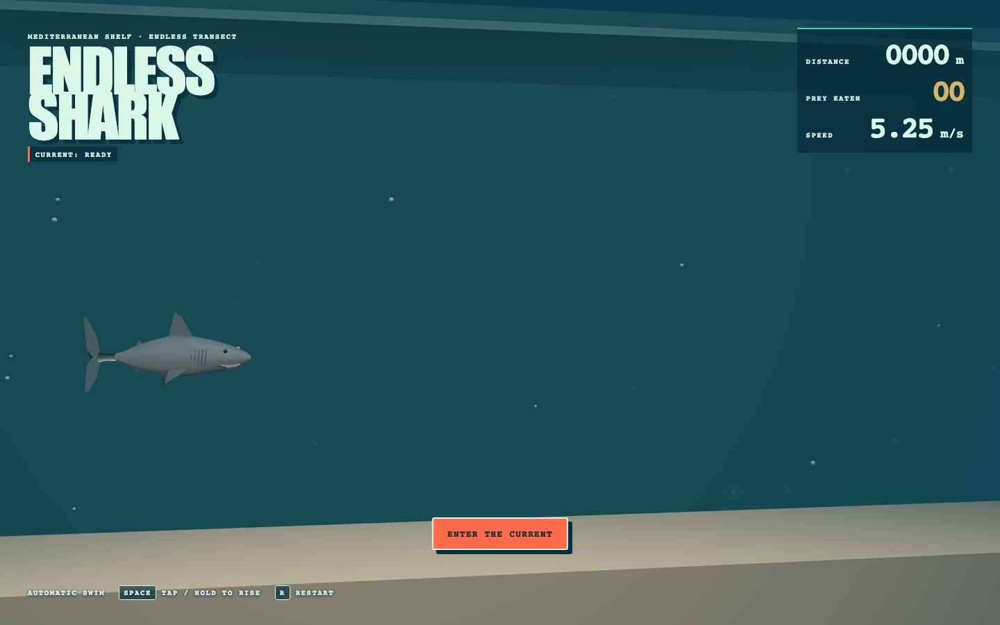
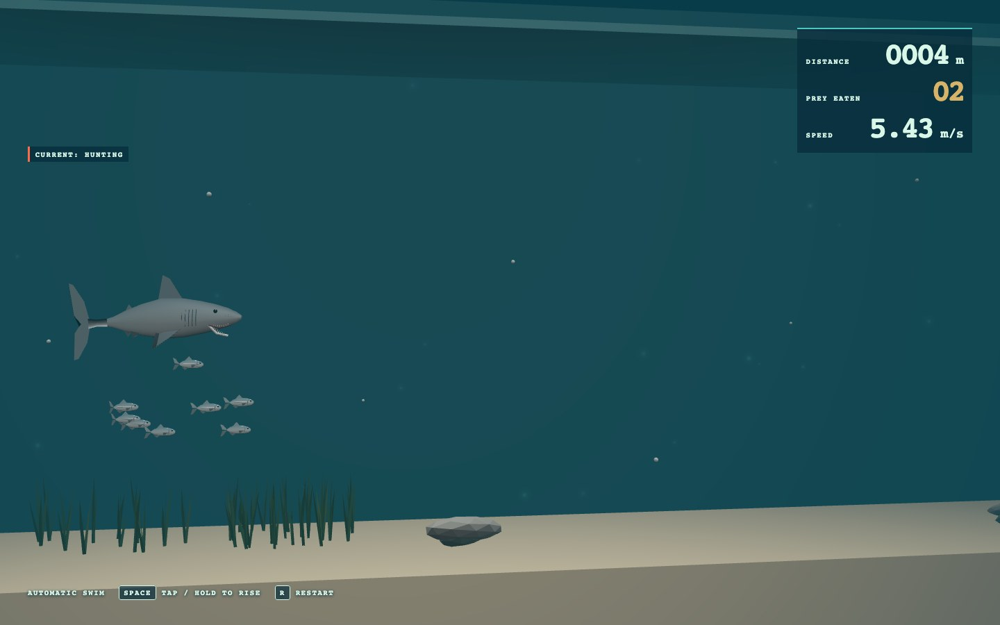
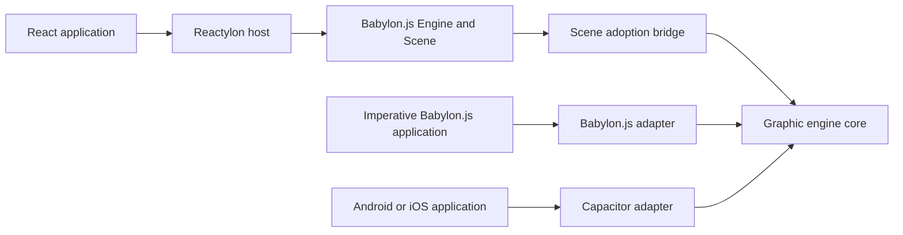

# Obsidian Eclipse Graphic Engine

Open-source runtime packages for Babylon.js and Capacitor applications.

## Playable sample

[Play Endless Shark](https://stefanodp91.github.io/obsidian-eclipse-graphic-engine/) directly in your browser.

Endless Shark is a React 19 application hosted by
[Reactylon 3.5.8](https://www.reactylon.com/docs). Reactylon owns the Babylon.js engine, scene,
canvas, render loop, and their disposal. The procedural game adopts that scene through a small
bridge exported by `obsidian-eclipse-graphic-engine/reactylon`. Reactylon is an optional peer of the
core package, so the integration is supported without imposing React on Babylon-only consumers.

| Ready to enter the current | Hunting across the Mediterranean shelf |
| --- | --- |
|  |  |

Run the sole sample locally:

```bash
npm install
npm run dev
```

## Architecture



### Where Reactylon is used

| Location | Role |
| --- | --- |
| [`packages/core/src/adapters/reactylon/index.ts`](packages/core/src/adapters/reactylon/index.ts) | Implements the engine's public `ReactylonSceneBridge` integration. |
| [`samples/endless-platformer/src/main.tsx`](samples/endless-platformer/src/main.tsx) | Uses Reactylon's `Engine` and `Scene` with the engine-provided bridge. |
| [`samples/endless-platformer/src/game.ts`](samples/endless-platformer/src/game.ts) | Receives the Reactylon-owned Babylon scene and mounts the procedural game into it. |
| [`docs/adr/0002-reactylon-as-optional-scene-owner.md`](docs/adr/0002-reactylon-as-optional-scene-owner.md) | Records the ownership boundary and optional peer-dependency decision. |

```text
packages/core/                 Babylon.js runtime and adapters
packages/capacitor/            optional Capacitor services and native plugins
samples/endless-platformer/    playable Reactylon-hosted reference game
docs/adr/                      architecture decisions
```

## Get started

```bash
npm install
npm run check
```

Package documentation:

- [`obsidian-eclipse-graphic-engine`](packages/core/README.md)
- [`obsidian-eclipse-capacitor-plugins`](packages/capacitor/README.md)
- [Core architecture and guides](packages/core/wiki/index.md)
- [Capacitor architecture and guides](packages/capacitor/wiki/index.md)
- [Playable Endless Platformer sample](samples/endless-platformer/README.md)

## Credits

[Reactylon](https://www.reactylon.com/docs) was created by Simone De Vittorio and is used under the
MIT License. See [Credits and third-party software](THIRD_PARTY_NOTICES.md) for Reactylon,
Babylon.js, Havok integration, React, their upstream projects, and license information.

## Releases

GitHub Releases are generated automatically from semantic-version tags. Each release contains the
core and Capacitor package tarballs, the built Endless Shark sample, and SHA-256 checksums. See
[`docs/RELEASING.md`](docs/RELEASING.md) for the release procedure.

## License

MIT © Obsidian Eclipse contributors.
