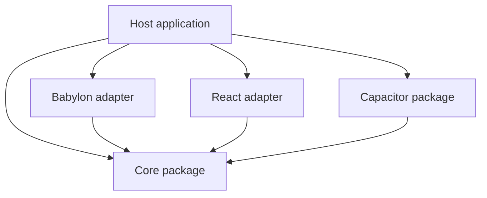

# ADR 0001: Standalone engine and optional native adapter

**Status:** accepted
**Date:** 2026-08-31

## Context

The repository serves consumers with different platform and framework requirements. Every consumer
needs the framework-independent engine contracts, while only some need Babylon.js adapters, React,
Havok, or Capacitor native services. A single entry point would force optional runtimes into every
application and obscure resource ownership.

The Capacitor package implements the engine-owned `NativeServices` port. Its TypeScript and native
sources depend on engine contracts and Capacitor, while the engine core has no import from Capacitor.

## Decision

Maintain one public repository with independently installable packages:

- `packages/core` builds the ESM package `obsidian-eclipse-graphic-engine`;
- the optional React driving adapter is exported from `obsidian-eclipse-graphic-engine/react`;
- the optional Reactylon scene bridge is exported from `obsidian-eclipse-graphic-engine/reactylon`;
- `packages/capacitor` publishes `obsidian-eclipse-capacitor-plugins` and ships its Android/iOS code;
- `samples/endless-platformer` is a Reactylon-hosted reference game that consumes the package's root
  `/cache`, and `/reactylon` exports while Reactylon owns the Babylon engine, scene, and render loop;
- the sample uses original art direction and platform mechanics, not Nintendo names or assets;
- GitHub Releases package verified artifacts without requiring npm publication.

The Capacitor adapter moves with the engine repository but remains a distinct package. This keeps
the engine-to-platform dependency inverted while allowing contract changes to be tested and released
from one workspace.

## Consequences

- Consumers install build output instead of compiling internal source paths.
- Vanilla consumers do not need React or Capacitor.
- Native releases require both the TypeScript build and native-contract check.
- Consumers must switch from source aliases only after the package passes its own typecheck, tests,
  library build, consumer build and package dry-run.
- A later repository split of the Capacitor package remains possible because there is no runtime cycle.

## Alternatives rejected

### Merge Capacitor into the core package

Rejected because it makes native tooling part of every web or Babylon installation and violates the
driven-port dependency direction.

### Put Capacitor in a separate repository immediately

Rejected because the native facade consumes engine contracts and benefits from atomic contract
checks. The package boundary already preserves future separability.

### Keep source aliases

Rejected because aliases couple the package to consumer bundlers and do not prove an independent
build or installation surface.
