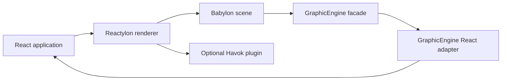

# ADR 0002: Reactylon as an optional scene owner

**Status:** accepted
**Date:** 2026-08-31

## Context

The engine already supports Babylon.js 9, React 19, and optional Havok physics. Reactylon combines
those technologies through a custom React renderer: it owns Babylon engine and scene construction,
creates scene entities from JSX, disposes them during React reconciliation, and exposes the ready
Babylon scene to integration code.

Making Reactylon mandatory would exclude imperative Babylon applications and non-React tools. Not
documenting it would leave React consumers to rebuild lifecycle and ownership integration without a
reference architecture.

## Decision

Treat Reactylon as a first-class optional scene owner with a dedicated engine package entry point.

- The core package continues to adopt an existing scene.
- Reactylon is an optional peer dependency, not an unconditional core runtime dependency.
- `obsidian-eclipse-graphic-engine/reactylon` exports `ReactylonSceneBridge` as the supported
  integration boundary.
- Reactylon owns JSX-created Babylon entities and their disposal.
- The graphic engine owns only resources explicitly created through its facade and adapters.
- `samples/endless-platformer` is the only sample. It demonstrates how a procedural game uses the
  engine-provided bridge without forcing generated models into JSX.

## Consequences

- React applications gain a documented declarative path without coupling every consumer to React.
- Ownership must be explicit to prevent Reactylon and the engine from disposing the same resource.
- The existing `/react` adapter remains useful for exposing quality, phase, tier, and frame services
  inside the React tree.
- Compatibility is tested at the consumer boundary, allowing Reactylon versions to evolve without
  forcing a core major release unless the public adapter contract changes.

## References

- [Reactylon documentation](https://www.reactylon.com/docs)
- [Reactylon Engine and Scene](https://www.reactylon.com/docs/engine-scene)
- [Reactylon hooks](https://www.reactylon.com/docs/hooks)
- [Reactylon physics](https://www.reactylon.com/docs/physics)
