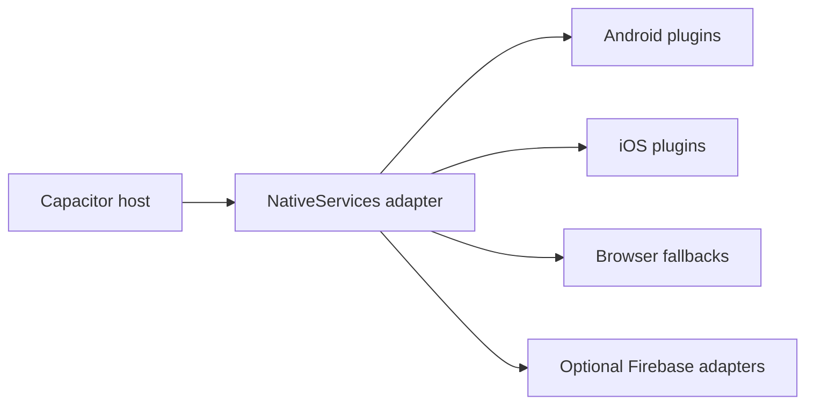

# obsidian-eclipse-capacitor-plugins

Optional Capacitor 8 adapters for `obsidian-eclipse-graphic-engine`. The package implements the
engine's `NativeServices` port and ships native Android and iOS plugins for thermal state and display
refresh information.

It also provides battery, preferences and wake-lock adapters with browser fallbacks, plus optional
Firebase observability adapters.



## Requirements

- Capacitor 8
- `obsidian-eclipse-graphic-engine` 0.1 or newer
- Android 10 or newer for complete thermal APIs
- iOS 15 or newer

## Install

```bash
npm install obsidian-eclipse-capacitor-plugins \
  obsidian-eclipse-graphic-engine \
  @capacitor/core @capacitor/device @capacitor/preferences \
  @capacitor-community/keep-awake
npx cap sync
```

`npx cap sync` discovers the package metadata and installs the bundled Java and Swift sources into
the native shells. No manual plugin registration is required.

## Basic usage

```ts
import {
  createCapacitorNativeServices,
  setNativeErrorSink,
} from 'obsidian-eclipse-capacitor-plugins';

setNativeErrorSink((domain, error, context) => {
  console.error(domain, error, context);
});

const nativeServices = createCapacitorNativeServices();
```

Inject `nativeServices` wherever the `NativeServices` driven port is required. The object exposes
platform detection, battery state, preferences, wake lock, thermal state and refresh information.

## Public API

| Export | Purpose |
| --- | --- |
| `createCapacitorNativeServices()` | Creates the complete `NativeServices` adapter |
| `setNativeErrorSink()` | Installs an optional error callback for native fallbacks |
| `readBatteryStatus()` | Reads Capacitor Device data, then the Web Battery API |
| `prefs` | Async key/value storage backed by Capacitor Preferences or `localStorage` |
| `requestWakeLock()` / `releaseWakeLock()` | Controls the native or browser wake lock |
| `readThermalState()` | Returns `nominal`, `fair`, `serious` or `critical` |
| `onThermalStateChange()` | Subscribes to thermal state changes |
| `readDeviceTemperature()` | Reads battery temperature when the platform exposes it |
| `readThermalHeadroom()` | Reads Android thermal headroom when supported |
| `readPowerSaveMode()` | Reads the current power-save state |
| `onPowerSaveModeChange()` | Subscribes to power-save state changes |
| `setRefreshMode()` | Requests `60` or `max` refresh mode where supported |
| `getRefreshInfo()` | Reads active and maximum display refresh information |

## Platform behavior

| Capability | Android | iOS | Browser fallback |
| --- | --- | --- | --- |
| Thermal state | `PowerManager` status and listener | `ProcessInfo.thermalState` | `nominal` |
| Device temperature | Battery broadcast | Not exposed | `null` |
| Thermal headroom | `PowerManager.getThermalHeadroom` | Not exposed | `null` |
| Power-save mode | `PowerManager` | `ProcessInfo.isLowPowerModeEnabled` | `false` |
| Display refresh | Window refresh preference and display modes | Read-only maximum FPS; mode request is a no-op | `null` / `false` |
| Preferences | Capacitor Preferences | Capacitor Preferences | `localStorage` |
| Wake lock | Capacitor community adapter | Capacitor community adapter | Screen Wake Lock API |

Fallbacks are intentionally non-throwing. Install an error sink when the application needs to
observe unavailable native plugins or degraded persistence.

## Optional Firebase adapters

Install only the integrations you use:

```bash
npm install firebase
npm install @capacitor-firebase/analytics
npm install @capacitor-firebase/crashlytics
npm install @capacitor-firebase/performance
```

The corresponding factories return `null` when the current platform or plugin is unavailable:

```ts
import {
  createFirebaseAnalyticsTracker,
  createFirebaseCrashReporter,
  createFirebasePerfTracer,
} from 'obsidian-eclipse-capacitor-plugins/firebase';
```

The root entry point never imports these integrations. Consumers that only need native services do
not need Firebase packages in their dependency graph.

## Development

From the repository root:

```bash
npm install
npm run typecheck --workspace obsidian-eclipse-capacitor-plugins
npm run check:native-contract --workspace obsidian-eclipse-capacitor-plugins
npm run build --workspace obsidian-eclipse-capacitor-plugins
npm pack --dry-run --workspace obsidian-eclipse-capacitor-plugins
```

The native contract check verifies plugin names, methods and package metadata across TypeScript,
Java, Swift, Swift Package Manager and CocoaPods definitions.

Read the [Capacitor adapter documentation](wiki/index.md) for architecture, installation, native
contracts, platform signals, observability, testing, and release guidance.

## Reference application

The [Endless Shark Capacitor sample](../../samples/endless-platformer-capacitor/README.md) is a
committed Android/iOS host that consumes this package through normal workspace resolution. Its
Android launcher follows a scripted deployment flow: it selects JDK 21, discovers connected
`adb` targets, synchronizes the web bundle, builds the debug APK, installs it and launches it. The
iOS launcher provides toolchain checks and simulator/device workflows. Use these hosts to validate
plugin discovery in addition to the package's native contract tests.

## Contributing

Changes to a native capability must keep Android, iOS and TypeScript contracts synchronized. Bug
reports and pull requests are welcome; read the repository contribution guide before contributing.

## License

MIT © Obsidian Eclipse contributors.
