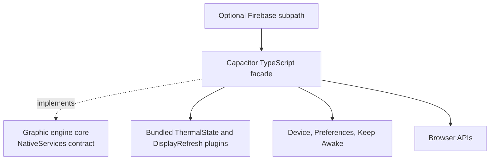

# Architecture

The package implements the core engine's `NativeServices` driven port. The core package does not
import Capacitor, so browser-only consumers do not carry a native bridge dependency.

The root entry point imports only the bridge required for native services. Firebase integrations
live under `/firebase` and use dynamic imports, so applications that do not import that subpath do
not bundle those plugins.

## Fallback policy

Capabilities return a neutral value when unavailable instead of crashing the application. Examples
include `null` for unavailable battery or refresh data, `nominal` for missing thermal state, and
`false` for an unsupported refresh request. Preferences and wake lock fall back to browser APIs.

Neutral fallbacks preserve availability but can hide degraded behavior. Install `setNativeErrorSink`
when the host needs to distinguish an expected browser fallback from a missing or failed native
plugin.

## Ownership

The package owns bridge mechanics and reusable native implementations. The host owns consent,
telemetry policy, persistence keys, refresh-mode preferences, polling schedules, and user-facing
error handling.
