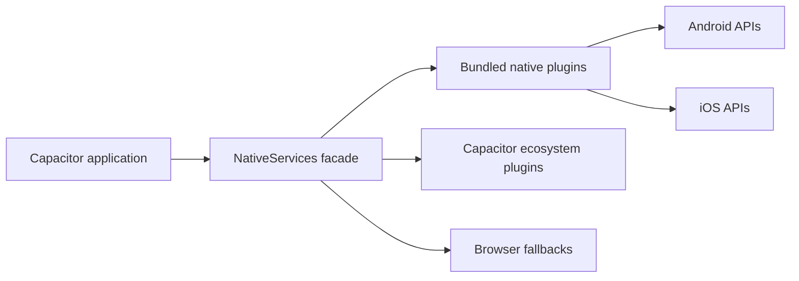

# Capacitor adapter documentation

The `obsidian-eclipse-capacitor-plugins` package connects the engine's platform-neutral
`NativeServices` port to Capacitor 8 and to browser fallbacks.

## Guides

- [Architecture](architecture.md) explains the dependency and fallback model.
- [Installation](installation.md) covers package installation and native synchronization.
- [Native plugins](native-plugins.md) documents Android and iOS registration and parity.
- [Power and thermal signals](power-and-thermal.md) defines platform behavior and limitations.
- [Observability](observability.md) covers the optional Firebase adapter subpath.
- [Testing and release](testing-and-release.md) describes contract checks and GitHub Releases.
- The [native reference sample](../../../samples/endless-platformer-capacitor/README.md) demonstrates
  installation, platform projects, doctor checks, target discovery and emulator/device deployment.

This wiki documents the reusable package. The reference sample demonstrates local host integration,
but application signing, store deployment, Firebase projects, analytics taxonomies, and product
build pipelines remain the responsibility of each consuming application.
