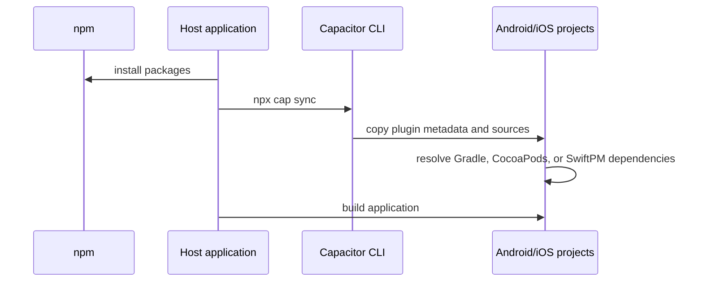

# Installation

Install the adapter with the engine and the non-optional Capacitor peers:

```bash
npm install obsidian-eclipse-capacitor-plugins \
  obsidian-eclipse-graphic-engine \
  @capacitor/core @capacitor/device @capacitor/preferences \
  @capacitor-community/keep-awake
npx cap sync
```

`cap sync` copies the package metadata and native sources into the Android and iOS projects. The two
custom plugins are discovered automatically; the host does not register them in its activity or app
delegate.



## Runtime setup

Create the adapter once during application startup and inject it into the engine host wiring:

```ts
import {
  createCapacitorNativeServices,
  setNativeErrorSink,
} from 'obsidian-eclipse-capacitor-plugins';

setNativeErrorSink((domain, error, context) => {
  reportPlatformFailure({ domain, error, context });
});

const nativeServices = createCapacitorNativeServices();
```

## Platform requirements

- Capacitor 8;
- Android API 24 minimum, with complete thermal status APIs from API 29;
- iOS 15 or newer;
- Java 21 for the Android library build;
- Swift Package Manager 5.9 metadata or CocoaPods in the host project.

## Verify with the reference host

The committed [Capacitor sample](../../../samples/endless-platformer-capacitor/README.md) can verify
the complete host toolchain and deploy to a discovered target:

```bash
cd samples/endless-platformer-capacitor
./ios.sh doctor
./android.sh
./ios.sh
```

The Android launcher selects the Homebrew JDK 21 and deploys to an already connected physical
device or running emulator. It selects the sole `adb` target automatically, offers a menu for
multiple targets, and accepts `--serial=<id>` or `ANDROID_SERIAL` for explicit selection. The iOS
launcher retains its doctor check and can start a configured iPhone Simulator when none is active.
