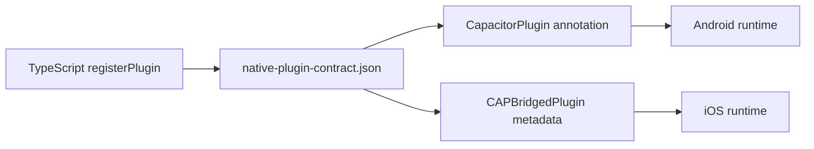

# Native plugins

The package ships two custom plugins with matching TypeScript, Java, and Swift names.

| Plugin | Methods | Android | iOS |
| --- | --- | --- | --- |
| `ThermalState` | state, temperature, headroom, power save | full where the OS supports it | state and power save; temperature and headroom return `null` |
| `DisplayRefresh` | set mode, read refresh information | mode request and display enumeration | read-only implementation; runtime mode request is a no-op |

The public `NativeServices` facade currently activates `DisplayRefresh` only on Android. The iOS implementation keeps the native contract aligned, but consumers should not assume that the facade exposes runtime refresh control on iOS.

## Contract changes

When adding or renaming a native method:

1. update `native-plugin-contract.json`;
2. update the TypeScript proxy and result types;
3. update the Android plugin method;
4. update the iOS `pluginMethods` declaration and implementation;
5. run `npm run check:native` from the repository root;
6. compile both host platforms before release.

The contract script validates names and declared methods. It is not a Java or Swift compiler and does
not prove runtime behavior.

## Source packaging

Android sources, the manifest, Gradle metadata, Swift sources, `Package.swift`, and the podspec are
included in the npm tarball. Always inspect `npm pack --dry-run` when changing native paths.
