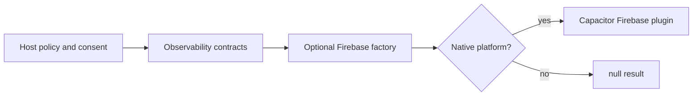

# Observability

Observability contracts are exported from the root package without importing Firebase. Concrete
Firebase factories are available from `obsidian-eclipse-capacitor-plugins/firebase`.

Install only the native integrations used by the host:

```bash
npm install @capacitor-firebase/analytics
npm install @capacitor-firebase/crashlytics
npm install @capacitor-firebase/performance
```



Each factory resolves to `null` off native or when its plugin cannot be loaded. Event and trace calls
are best-effort. Consent controls such as `setEnabled` propagate failures because silently ignoring a
user-visible privacy setting would be unsafe.

The host owns event names, parameters, user consent, retention, data classification, and Firebase
project configuration. Do not place project identifiers, service-account files, platform config
files, or credentials in this reusable repository.

The native error sink is separate from Firebase. It allows a host to route adapter degradation to
any logging system without making Firebase a core dependency.
