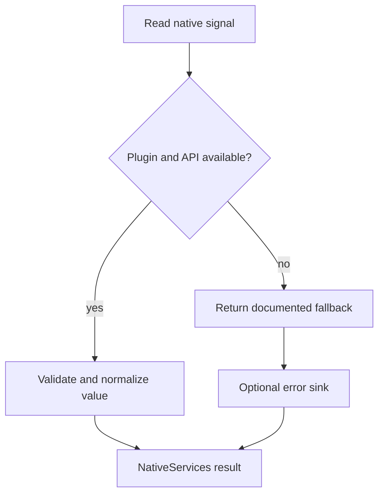

# Power and thermal signals

Mobile operating systems expose different levels of device information. The adapter preserves those
differences instead of inventing equivalent values.

| Capability | Android | iOS | Browser |
| --- | --- | --- | --- |
| Battery state | Capacitor Device | Capacitor Device | Battery API when available |
| Thermal state | `PowerManager` | `ProcessInfo.thermalState` | `nominal` fallback |
| Battery temperature | battery broadcast | unavailable | unavailable |
| Thermal headroom | API 30+ | unavailable | unavailable |
| Power-save mode | `PowerManager` | Low Power Mode | `false` fallback |
| Display refresh | display modes and window preference | panel maximum only | unavailable |
| Wake lock | Keep Awake plugin | Keep Awake plugin | Screen Wake Lock API |

Thermal headroom is rate-limited and cached because Android may return `NaN` when queried too often.
`null` means unavailable; it must not be interpreted as a cold device. Battery temperature on
Android is battery temperature, not CPU, GPU, or skin temperature.

The host decides polling frequency and mitigation. Appropriate responses may include lowering render
scale, reducing LOD, disabling expensive effects, limiting refresh rate, or pausing background work.
Avoid a high-frequency React state update loop for these signals.
