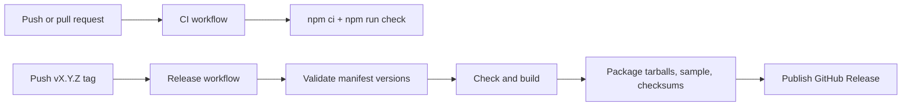

# Testing and release

The repository separates continuous verification from tag-driven GitHub Releases.



## Local verification

```bash
npm ci
npm run check
npm run pack:dry-run
```

`npm run check` covers TypeScript, unit tests, native contract alignment, and builds. Native plugin
changes additionally require compilation in representative Android and iOS host projects; the
string-based contract check cannot replace platform compilers or device testing.

Use the committed reference host for environment and deployment validation:

```bash
cd samples/endless-platformer-capacitor
./android.sh doctor
./ios.sh doctor
./android.sh
./ios.sh
```

The doctor commands report missing dependencies without deploying. The no-argument commands then
discover a device or emulator/simulator, synchronize the web bundle and compile/install the app.
Android requires JDK 21; physical iOS devices and IPA builds require an Apple development team.

## Release contents

A semantic-version tag matching every workspace manifest triggers the release workflow. GitHub
Actions attaches:

- the core package `.tgz`;
- the Capacitor package `.tgz`;
- the built Endless Platformer sample `.zip`;
- `SHA256SUMS.txt`.

The workflow creates GitHub Releases only. It does not publish to npm, sign mobile applications, or
deploy a website. See the repository-level [release guide](../../../docs/RELEASING.md) for the exact
tagging procedure.
