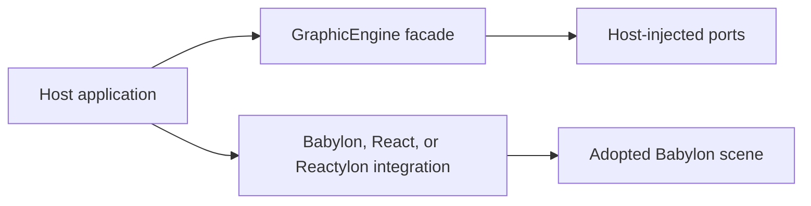

# obsidian-eclipse-graphic-engine

An ESM runtime toolkit for Babylon.js applications. It provides a small facade for lifecycle,
quality, input, frame scheduling and resource ownership, plus optional Babylon.js, React, and
Reactylon adapters.

The core follows a ports-and-adapters design: application state and platform services are injected,
so the runtime does not prescribe a state manager, UI framework or native bridge.



## Requirements

- Node.js 22 or newer
- `@babylonjs/core` 9
- React 19 only when using the React adapter
- Reactylon 3 only when using the Reactylon scene bridge
- `@babylonjs/havok` only when using Havok-backed features

## Install

```bash
npm install obsidian-eclipse-graphic-engine @babylonjs/core
```

Optional peers can be installed as needed:

```bash
npm install react reactylon
npm install @babylonjs/havok
```

## Package exports

| Import | Purpose |
| --- | --- |
| `obsidian-eclipse-graphic-engine` | Domain types, ports and `createGraphicEngine()` |
| `obsidian-eclipse-graphic-engine/babylon` | Babylon.js rendering, pooling, quality and performance adapters |
| `obsidian-eclipse-graphic-engine/cache` | Tier-aware `AssetCache` |
| `obsidian-eclipse-graphic-engine/react` | Provider and hooks for React 19 |
| `obsidian-eclipse-graphic-engine/reactylon` | Bridge from a Reactylon-owned scene to engine-backed imperative behavior |

## Basic usage

The facade adopts a rendering scene and delegates stateful behavior to injected ports:

```ts
import { EnginePhase, createGraphicEngine } from 'obsidian-eclipse-graphic-engine';
import { AssetCache } from 'obsidian-eclipse-graphic-engine/cache';

const assets = new AssetCache(128);
let quality = 'mobile-mid' as const;

const engine = createGraphicEngine({
  keyPrefix: 'my-application',
  rendering: { scene },
  quality: {
    get: () => quality,
    update: (next) => {
      quality = next;
      return true;
    },
    subscribe: () => () => {},
  },
  frame: {
    add: (callback) => {
      scene.registerBeforeRender(callback);
      return () => scene.unregisterBeforeRender(callback);
    },
  },
  assets,
  phase: (next) => {
    renderer.renderEvenInBackground = next !== EnginePhase.Halted;
  },
  onDispose: () => assets.disposeAll(),
});

const removeFrameTask = engine.frame.add(() => {
  // Imperative per-frame work.
});

removeFrameTask();
engine.dispose();
```

`keyPrefix` is mandatory. It namespaces persisted keys and prevents a reusable package from owning
an application-specific storage name.

## React adapter

```tsx
import {
  GraphicEngineProvider,
  useEngine,
  useFrame,
  usePhase,
  useQuality,
  useTier,
} from 'obsidian-eclipse-graphic-engine/react';

function SceneController() {
  const engine = useEngine();
  useFrame(() => {
    // Imperative rendering work; avoid state updates on every frame.
  });
  return null;
}

export function Application() {
  return (
    <GraphicEngineProvider engine={engine}>
      <SceneController />
    </GraphicEngineProvider>
  );
}
```

The provider never creates or disposes the engine. The caller owns its lifecycle. Hooks throw when
used outside the provider, and `useTier`, `useQuality` and `usePhase` subscribe through external
store semantics.

## Reactylon adapter

The engine includes an optional Reactylon integration entry point. Reactylon owns the Babylon.js
engine, scene, canvas, render loop, and disposal; the bridge mounts engine-backed behavior into that
scene and runs its cleanup when the scene unmounts.

```tsx
import { Scene } from 'reactylon';
import { Engine } from 'reactylon/web';
import { ReactylonSceneBridge } from 'obsidian-eclipse-graphic-engine/reactylon';

export function Application() {
  return (
    <Engine>
      <Scene>
        <ReactylonSceneBridge mount={mountGame} />
      </Scene>
    </Engine>
  );
}
```

`mountGame(scene)` must return a cleanup function for the resources it adds. The playable
[Endless Shark sample](../../samples/endless-platformer/README.md) is the reference gameplay
consumer; its [Capacitor host](../../samples/endless-platformer-capacitor/README.md) packages the
same Reactylon application for native devices and simulators.

## Architecture

- Domain modules contain framework-independent types and deterministic policy.
- Driving ports expose the public runtime facade.
- Driven ports describe services supplied by the caller.
- Concrete Babylon.js, web and React integrations live in adapters.
- Platform-specific integrations remain optional and are injected through ports.

Prefer root imports for the facade and explicit subpath imports for concrete adapters. Avoid deep
imports into `src/`; only declared package exports are public API.

Read the [core engine documentation](wiki/index.md) for lifecycle, ownership, quality, Babylon,
cel-rendering, performance, and Reactylon integration guides.

## Baked cel hull thickness

`bakeCelHullIntoMesh` from `obsidian-eclipse-graphic-engine/babylon` uses local mesh units.
For each eligible connected component its stroke is bounded by:

```text
min(requestedWidth, 0.45 * inwardSurfaceDistance, 0.45 * 4 * abs(volume) / area)
```

The inward ray follows the outward-oriented smoothed normal in reverse and intersects actual
triangles in that component, using a bake-time BVH. Other components cannot supply an opposite
wall. Searches stop at `requestedWidth / 0.45`; a miss leaves the component volume/area bound in
force. This is a directional thickness and component-size policy, not a shortest-distance or
screen-pixel thickness guarantee. It handles sparse faces and caps without relying on opposite
vertices. Collapsed triangles do not count as topological edges; open or inconsistent surfaces
remain excluded by the existing eligibility checks.

All added work happens during baking; the runtime keeps the same single indexed mesh and material.
Body positions and physical bounds from `celBodyBoxOf` are preserved (subject to Float32 buffer
precision). Baking remains irreversible and transforms applied later scale the stroke with the body.

Essential meshes that cannot bake (for example, dynamic PBR meshes) retain the existing uniform
per-mesh fallback, unless explicitly marked with `markCelOutlineNoHullFallback`. Dynamic shader
hulls also retain their explicit uniform thickness. These paths do not rewrite host-owned buffers
or silently adopt the static bake policy. Switching to baked mode clears the previous per-mesh
pass; disabling the mode stops fallback passes but cannot remove already baked geometry.

## Development

From the repository root:

```bash
npm install
npm run typecheck --workspace obsidian-eclipse-graphic-engine
npm test --workspace obsidian-eclipse-graphic-engine
npm run build --workspace obsidian-eclipse-graphic-engine
npm pack --dry-run --workspace obsidian-eclipse-graphic-engine
```

The build produces ESM modules, TypeScript declarations and source maps in `dist/`.

## Contributing

Bug reports and pull requests are welcome. Read the repository contribution guide before proposing
API or architecture changes. New public behavior should include tests and must preserve the package
boundary.

## License

MIT © Obsidian Eclipse contributors.
