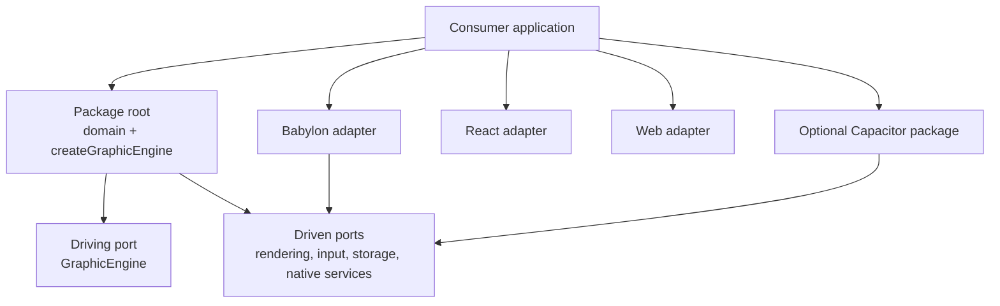

# Architecture

The engine uses a ports-and-adapters design. Its root entry point is a framework-independent facade;
concrete Babylon.js and React integrations live behind explicit subpath exports.

## Package layers

The dependency rule points inward: domain types do not import Babylon.js, React, Capacitor, or host
state. Adapters may import the domain and ports, never the reverse.

## Public entry points

| Import | Responsibility | Required peer |
| --- | --- | --- |
| `obsidian-eclipse-graphic-engine` | Domain contracts and engine facade | none at runtime |
| `obsidian-eclipse-graphic-engine/babylon` | Rendering, pooling, materials, profiling | `@babylonjs/core` |
| `obsidian-eclipse-graphic-engine/cache` | Tier-aware asset cache | none beyond the package |
| `obsidian-eclipse-graphic-engine/react` | Provider and hooks | `react` |

React and Havok are optional peers because not every consumer uses them. A Babylon-only consumer
must be able to install and run the Babylon adapter without React. New adapters should receive their
own subpath instead of expanding the root dependency graph.

## Adopted scene model

`createGraphicEngine()` adopts an existing scene object. It does not create a canvas, Babylon
engine, scene, React tree, or physics plugin. This allows an imperative Babylon host, Reactylon, a
test harness, or another renderer owner to control construction while the facade coordinates shared
runtime services.
