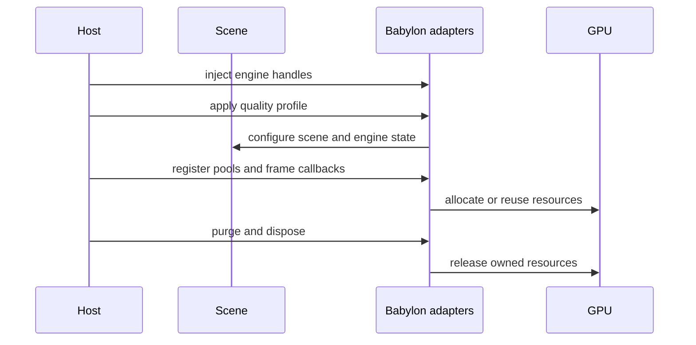

# Babylon adapters

The `/babylon` entry point contains optional mechanisms built on Babylon.js 9. Import only the
subpath when the application uses Babylon.js.

## Subsystems

| Area | Representative API | Purpose |
| --- | --- | --- |
| Engine handles | `engineHandles` | Inject session-level renderer, storage, input, and native services |
| Pools | `registerPoolType`, `createThinInstancePool` | Reuse meshes and instance slots |
| Materials | `acquireMaterial`, `acquirePBRMaterial` | Share and reference-count materials |
| Quality | `applyEngineProfile`, purge registry | Apply profile state and invalidate dependent caches |
| Scheduling | `setupRenderLoopGate`, `installMasterTick` | Control rendering and consolidate frame callbacks |
| Diagnostics | counters, error and performance sinks | Report failures and episodic performance signals |
| Rendering helpers | lighting, UV, realism, color, cel | Reusable scene and material utilities |

## Scheduling cautions

`installMasterTick()` replaces `scene.registerBeforeRender` and
`scene.unregisterBeforeRender` with a flat dispatcher. Install it before other systems register
callbacks. `setupRenderLoopGate()` controls whether the render loop and physics advance; the host
must keep lifecycle events and phase transitions synchronized.

### Render-loop ownership

`setupRenderLoopGate()` exclusively controls rendering on the supplied engine. It replaces host
render callbacks using Babylon's public `stopRenderLoop()` / `runRenderLoop()` APIs; use one gate
per engine and do not install another render-loop owner alongside it. Its callback renders the
supplied scene only when that scene has an active camera.

Ownership starts unknown, rather than assuming the host's existing callback is already gated.
The first state notification replaces that callback when active, or stops it when inactive.
Repeated notifications of the same state do not register additional callbacks.

The existing one-second startup window allows hosts such as Reactylon to finish registering their
loop after scene-ready. At its end the gate reconciles again, even if a state notification already
arrived, so a late host registration cannot leave an uncapped callback running. Without an earlier
notification the first reconciliation happens at this deadline; the host loop can still run during
that startup window. Hosts must complete their loop registration within this window and leave
render-loop ownership to the gate afterwards.

Cleanup cancels the startup timer, unsubscribes state listeners and stops rendering, including when
called before startup reconciliation. A captured gated callback is inert while stopped or disposed.
The scene and engine remain host-owned and must be disposed separately.

The target cap is read live by the gated callback. Positive finite targets use cumulative
scheduled deadlines: with sufficient callbacks and rendering capacity, the average approaches the
target without accumulating display-quantization drift. Individual intervals remain quantized by
the display. A target change or resume starts a fresh phase and renders immediately; long stalls
discard accumulated debt. Null, non-positive and non-finite values uncap the loop.

Count `scene.onAfterRenderObservable` to validate delivered renders; rAF and engine frame counters
also count callbacks whose render is skipped. Startup-window and ownership limits above still apply.
Coverage includes [lifecycle](../src/adapters/babylon/RenderLoopGate.lifecycle.test.ts) with Babylon's
real callback registry and [pacing](../src/adapters/babylon/RenderLoopGate.pacing.test.ts) across
60/90/120 Hz callback streams, jitter, target changes, stalls and pause/resume.

## Global switches

Some adapters modify Babylon-wide state, including persistent shader caching and log suppression.
Install them deliberately, restore them during tests, and avoid treating them as scene-local.
