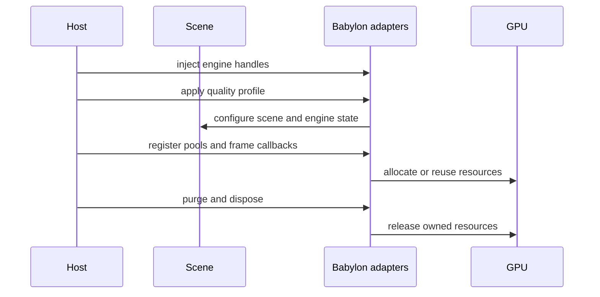

# Babylon adapters

The `/babylon` entry point contains optional mechanisms built on Babylon.js 9. Import only the
subpath when the application uses Babylon.js.

## Subsystems

| Area | Representative API | Purpose |
| --- | --- | --- |
| Engine handles | `engineHandles` | Inject session-level renderer, storage, input, and native services |
| Pools | `registerPoolType`, `createThinInstancePool` | Reuse meshes and instance slots |
| Materials | `acquireMaterial`, `acquirePBRMaterial` | Share and reference-count materials |
| Quality | `applyEngineProfile`, purge registry | Apply profile state and invalidate dependent caches |
| Scheduling | `setupRenderLoopGate`, `installMasterTick` | Control rendering and consolidate frame callbacks |
| Diagnostics | counters, error and performance sinks | Report failures and episodic performance signals |
| Rendering helpers | lighting, UV, realism, color, cel | Reusable scene and material utilities |

## Scheduling cautions

`installMasterTick()` replaces `scene.registerBeforeRender` and
`scene.unregisterBeforeRender` with a flat dispatcher. Install it before other systems register
callbacks. `setupRenderLoopGate()` controls whether the render loop and physics advance; the host
must keep lifecycle events and phase transitions synchronized.

## Global switches

Some adapters modify Babylon-wide state, including persistent shader caching and log suppression.
Install them deliberately, restore them during tests, and avoid treating them as scene-local.
