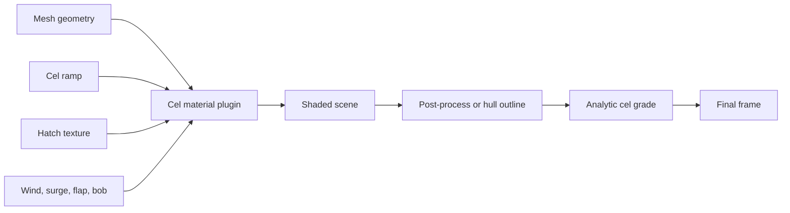

# Cel rendering

The cel subsystem is experimental public API. It combines material shading, cached ramp and hatch
textures, analytic grading, optional deformation, and outline strategies. Consumers should pin an
engine version and validate visuals before adopting it in a stable product.

## Main surfaces

- `createCelMaterial()` creates a dedicated cel material and handle.
- `registerCelPlugin()` adds cel behavior to compatible existing materials.
- `getCelRamp()` and `getCelHatch()` cache generated lookup textures.
- `attachCelOutline()` installs the selective outline post-process.
- hull helpers provide a geometry-based alternative and preserve the original body bounds.
- `applyCelLook()` and `applyCelGrade()` update coherent groups of look controls.

The default outline choice is the post-process path. Hull mode remains useful for comparison and
special cases but can expose gaps on hard-edged geometry with split normals.

## Baked outline contract

The [package guide](../README.md#baked-cel-hull-thickness) defines the local-unit stroke bound,
component surface queries, volume/area estimate, and dynamic fallback behavior. Baking uses
triangles from the owning connected component rather than nearby vertices from other solids.
Collapsed triangles are excluded from edge topology, allowing genuine closed poles/caps to bake.
This can restore outlines on components previously skipped; it is not merely a global reduction
of ink. Body bounds remain available through `celBodyBoxOf`.

Validate both emitted indices and vertex counts: the buffer can contain hull vertices that are
not drawn. Measure first-use baking separately from steady rendering. Baking more eligible
components can increase emitted triangles without increasing the buffer's total vertex count.
Check pooled and directly created geometry, thin/tapered parts, open surfaces, and fallback
transitions. A baked outline cannot be removed by disabling the mode; an active per-mesh fallback
can. Content approval belongs to the host.

## Ownership

The engine owns shader mechanics and safe defaults. The consumer owns palette, artistic direction,
mesh eligibility, texture budget, and acceptance tests. Dispose cached ramps, hatches, post-processes,
and handles when their scene is destroyed.
