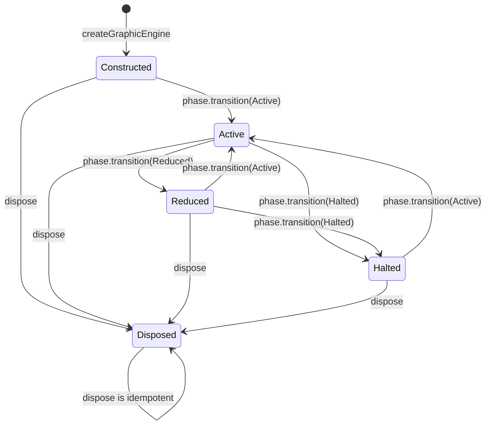

# Engine lifecycle

The facade is created after a rendering scene exists. The caller injects observable state and
resource services, then retains ownership of the underlying renderer.

`EnginePhase` deliberately has only three rendering states:

| Phase | Intended rendering state | Intended physics state |
| --- | --- | --- |
| `Active` | running | running |
| `Reduced` | running | paused or reduced by the host |
| `Halted` | stopped | stopped |

The host maps its own screens and gameplay states onto these values. The core never imports a host
state machine.

## Construction rules

- `keyPrefix` is mandatory and namespaces persisted state.
- `rendering.scene` must reference an existing scene-like object.
- the quality port is required;
- tier, phase source, frame registration, resources, and input are optional;
- missing optional ports use neutral no-op behavior.

## Disposal

`dispose()` is idempotent and invokes the host-provided `onDispose` callback once. Writes after
disposal throw because they would mutate torn-down state. Read subscriptions remain callable during
framework teardown. This contract also applies when optional ports are absent.

Operations that change resource ownership are writes: asset `set`, `acquire`, `release`, and
`clearTier`; material acquisition and release; pool registration, acquisition, release, and
prewarming. `input.consumeJump()` is also a write because it consumes a queued event. After
`dispose()`, these operations throw before invoking any injected service, just like phase changes,
quality updates, frame registration, and input attachment.

Release resources before disposing the facade. Inside `onDispose`, clean up the host-owned services
directly rather than calling facade mutators: the facade is already marked disposed before that
callback runs. Previously returned unsubscribe/detach functions remain callable. If host cleanup
throws, its error propagates; the facade remains disposed and does not retry cleanup on a second
`dispose()` call.

These rules are exercised with both connected and absent optional ports in
[`disposal.test.ts`](../src/api/disposal.test.ts).

The facade does not automatically dispose the adopted scene, Babylon engine, React root, or native
bridge. The component that created each resource must destroy it.
