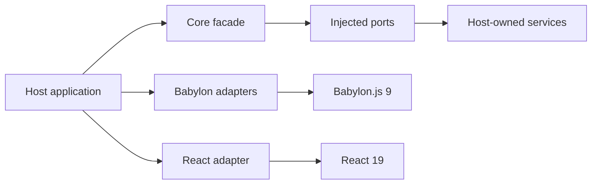

# Core engine documentation

This documentation describes the standalone `obsidian-eclipse-graphic-engine` package as it exists
in this repository. It contains no migration log, product history, or assumptions about a specific
host application.

## Start here

- [Architecture](architecture.md) explains package boundaries and dependency direction.
- [Engine lifecycle](engine-lifecycle.md) covers creation, phases, frame callbacks, and disposal.
- [Quality and device profiling](quality-and-device-profiling.md) describes presets and measured
  device caps.
- [Resource management](resource-management.md) defines ownership for caches, materials, mesh pools,
  and thin instances.
- [Babylon adapters](babylon-adapters.md) maps the public `/babylon` entry point to its subsystems.
- [Cel rendering](cel-rendering.md) documents the experimental cel-shading surface.
- [React and Reactylon](react-and-reactylon.md) explains both React integration options.
- [Public API audit](public-api-audit.md) records exhaustive facade and consumer coverage.
- [Performance validation](performance-validation.md) provides a repeatable measurement protocol.

## Documentation boundary

The package owns reusable rendering mechanisms and contracts. A host owns content, scene
composition, UI state, quality policy, analytics policy, and product-specific thresholds.

Only exports declared in `packages/core/package.json` are public API. Source paths under `src/` are
implementation details.
