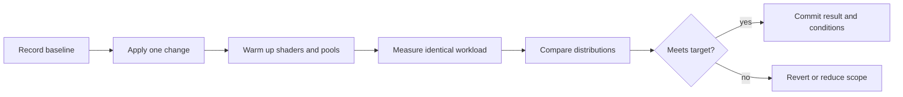

# Performance validation

Performance claims are meaningful only when the workload and environment are recorded. Do not copy
device-specific thresholds from another application into this package documentation.

## Measurement record

For every benchmark, record:

- engine package version and commit;
- Babylon.js version and WebGL or WebGPU backend;
- device, operating system, browser or WebView version;
- display refresh rate and selected quality preset;
- scene description and asset counts;
- warmup duration and sample duration;
- median, p95, p99, and worst-window frame time;
- draw calls, active triangles, materials, textures, and render scale;
- battery, power-save, and thermal state when available.

## Built-in diagnostics

Use engine counters for draw calls, indices, triangles, and vertices. Use performance and error sinks
for episodic signals rather than logging every frame. Pool telemetry is diagnostic-only and should
not remain enabled in production hot paths.

Automated unit tests protect lifecycle invariants, but they do not replace device testing for GPU
memory, shader compilation, WebGPU validation, high-refresh behavior, or thermal throttling.
