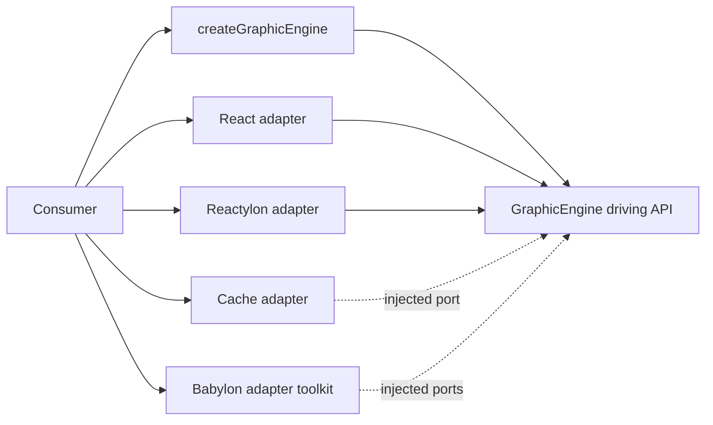

# Public API audit

The engine API is the `GraphicEngine` driving facade returned by `createGraphicEngine`. Adapter
entry points such as `/babylon`, `/react`, and `/cache` are integration toolkits; they support the
facade but are not methods invoked by the facade itself.

## Exhaustive facade coverage

`packages/core/src/api/index.test.ts` declares every resource and every member with
`satisfies Record<keyof ...>`. TypeScript therefore fails when a member is added to the public
contract without updating the coverage manifest. The runtime test also compares the returned object
shape with that manifest and invokes every operation.

| Resource | Covered API |
| --- | --- |
| phase | `transition`, `get`, `subscribe` |
| tier | `get`, `subscribe` |
| quality | `get`, `update`, `subscribe` |
| frame | `add` |
| assets | `set`, `get`, `acquire`, `release`, `clearTier`, `has`, `size` |
| materials | `acquire`, `acquireTiered`, `release` |
| pools | `register`, `acquire`, `releaseType`, `prewarm` |
| input | `attach`, `lateral`, `consumeJump` |
| lifecycle | `dispose` |

## Consumer coverage

- Endless Shark exercises the `/reactylon` bridge, scene adoption, phase transitions, frame
  callbacks, input, and the cache adapter.
- The facade contract test exercises the remaining asset, material, pool, and subscription paths.
- Babylon adapter helpers are independently importable library capabilities. They are validated by
  type checking, package builds, lifecycle tests, and downstream consumers; they are not artificial
  facade calls and should not be invoked merely to increase a usage count.

Run the complete verification with `npm run check`.
