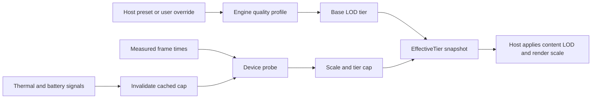

# Quality and device profiling

Quality is expressed as a small, device-oriented contract rather than a catalogue of visual
features. The engine recognizes three presets and three LOD tiers:

- presets: `mobile-flagship`, `mobile-mid`, `mobile-low`;
- tiers: `hi`, `mid`, `lo`.

The host supplies an `EngineQualityProfile` for each preset. The engine reads only rendering and
physics controls such as LOD tier, mip bias, lighting mode, emissive boost, and physics step rate.

## Resolution flow

The boot probe observes frames from a real scene, computes a conservative scale cap, classifies a
tier cap, and persists the result with the configured application version. A version mismatch or an
explicit invalidation causes a new probe.

`EffectiveTier` is a read-only snapshot containing the preset, base tier, effective tier, optional
render-scale override, derivation reason, and measured median frame time. Asset-family names and
per-content overrides remain host-owned.

## Operational guidance

- Configure the profile provider before applying a profile.
- Configure a non-empty storage prefix and application version before probing.
- Treat a missing cap as unknown capability, not proof of high performance.
- Keep user overrides explicit; device measurement should normally downgrade rather than upgrade.
- Feed thermal and battery signals through the provided signal-source interface if the host needs
  cached caps to be invalidated when operating conditions change.
