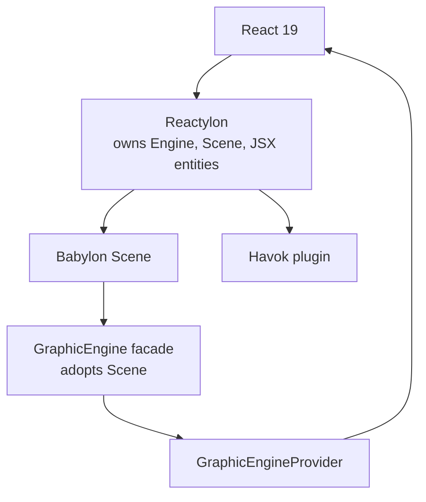

# React and Reactylon integration

The engine supports two complementary React integration levels.

## Lightweight React adapter

`obsidian-eclipse-graphic-engine/react` provides `GraphicEngineProvider`, `useEngine`, `useTier`,
`useQuality`, `usePhase`, and `useFrame`. It does not create a Babylon engine or scene. Use it when
the host already owns rendering and only needs reactive access to the facade.

## Reactylon as scene owner

[Reactylon](https://www.reactylon.com/docs) is a React 19 custom renderer for Babylon.js. It creates
and disposes scene entities declaratively, exposes the Babylon scene through `onSceneReady` and
hooks, prefers WebGPU with WebGL fallback, and supports Havok through scene physics options.

Reactylon is an optional peer dependency exposed through the engine's `/reactylon` entry point.
Imperative Babylon applications, non-React tools, and lightweight web consumers do not load it.



The integration point is the engine-provided `ReactylonSceneBridge`:

```tsx
import { Scene } from 'reactylon';
import { Engine } from 'reactylon/web';
import { ReactylonSceneBridge } from 'obsidian-eclipse-graphic-engine/reactylon';

export function Application() {
  return (
    <Engine>
      <Scene>
        <ReactylonSceneBridge mount={mountGame} />
      </Scene>
    </Engine>
  );
}
```

`mountGame(scene)` returns a cleanup function. Reactylon owns JSX-created scene entities; the
graphic engine integration owns only resources explicitly created by the mount callback. Avoid
having both systems dispose the same mesh, material, or physics aggregate.

The tested [Endless Shark sample](../../../samples/endless-platformer/README.md) is the sole consumer
fixture. The architectural decision is recorded in
[ADR 0002](../../../docs/adr/0002-reactylon-as-optional-scene-owner.md).
