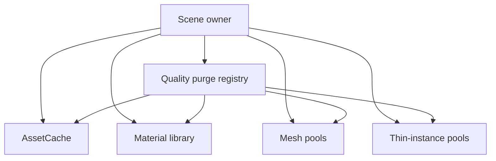

# Resource management

GPU resources fail quietly when ownership is ambiguous: memory grows, stale scene references remain,
or a shared object is disposed while still in use. The adapters therefore expose explicit lifetime
and reference-count contracts.

## Asset cache

`AssetCache` groups entries by `global`, `world`, or `level` tier. Entries may be acquired and
released through reference counts. Clear the narrowest tier that matches a transition, and call
`disposeAll()` during final teardown.

## Mesh pools

Mesh pools are scene-scoped registries keyed by a caller-defined type. A factory creates pooled
items and optional physics state. Prewarming allocates ahead of use; acquire/release reuses those
items; scene teardown releases live physics, owned extras, and pooled meshes once.

## Thin instances

Thin-instance pools allocate a fixed capacity and reuse slots. Matrix writes are batched until
`flush()`. The pool distinguishes owned materials from shared materials so disposal does not destroy
resources owned elsewhere.

## Materials and purge hooks

The material library reference-counts shared Standard and PBR materials. Consumers must pair every
acquire with a release. Register scene-specific cleanup in the quality purge registry when a quality
change invalidates GPU state that the engine cannot discover itself.

The component that creates a scene remains responsible for calling all final cleanup functions.
