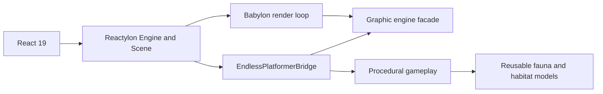

# Endless Shark

An original side-scrolling example in which a great white shark hunts through an infinite ocean
route. The level is generated deterministically in recyclable chunks and demonstrates the public
graphic engine facade, Reactylon scene ownership, frame scheduling, input port, lifecycle phases
and asset cache. [Play Endless Shark](https://stefanodp91.github.io/obsidian-eclipse-graphic-engine/).

Reactylon owns the Babylon engine, scene, render loop, canvas and disposal lifecycle. The
`EndlessPlatformerBridge` component mounts the procedural gameplay into the Reactylon scene and
returns a complete React effect cleanup. This keeps generated fauna, terrain and collision logic
framework-independent while demonstrating the supported React host architecture.

The integration entry point is [`src/main.tsx`](src/main.tsx). It consumes the bridge exported by
the engine package instead of implementing a second sample-specific lifecycle adapter:

```tsx
import { Scene } from 'reactylon';
import { Engine } from 'reactylon/web';
import { ReactylonSceneBridge } from 'obsidian-eclipse-graphic-engine/reactylon';

<Engine canvasId="game">
  <Scene>
    <ReactylonSceneBridge mount={mountEndlessPlatformer} />
  </Scene>
</Engine>
```

`Engine` and `Scene` are Reactylon components. `ReactylonSceneBridge` obtains their Babylon scene
inside the engine package; [`src/game.ts`](src/game.ts) then builds the procedural world without
creating another engine, scene, or render loop. This boundary is intentional: Reactylon owns the
host lifecycle while the gameplay remains reusable imperative Babylon.js code.



The example uses only procedural geometry and contains no third-party game assets.
Reactylon and the other runtime projects are credited in the repository's
[`THIRD_PARTY_NOTICES.md`](../../THIRD_PARTY_NOTICES.md).

Underwater illumination uses a procedural radial-alpha particle texture. The emitter follows the
active section of the infinite route, while particles remain in world space so their slow drift and
depth produce parallax instead of a camera-locked overlay.

## Run it

Requirements: Node.js 22 or newer and npm 10 or newer.

From the repository root:

```bash
npm install
npm run dev
```

Open <http://localhost:4173>. Vite prints the final URL in the terminal if that port is already in
use.

The camera framing, HUD and safe-area spacing adapt to both portrait and landscape screens.

You can also start it from this directory after installing the root workspace dependencies:

```bash
npm run dev
```

## Controls

- movement is automatic and always advances to the right
- tap `Space`: make a fine upward correction; hold it for a sustained ascent / breach
- pointer or touch: tap for a correction, hold for a sustained ascent / breach
- `R`: restart the route

Pass through natural limestone openings, stay between the surface and seabed, and hunt European
sardine schools and common squid. Prey react
to the approaching shark before they can be eaten. Chunks behind the camera are disposed and
replaced, so the route has no fixed end.

The route uses its original collision difficulty: surface, seabed and limestone formations end the
run. Cruise speed starts at 5.25 m/s and rises by 0.16 m/s for every prey eaten, up to 7.5 m/s.
`Space` starts with a restrained vertical impulse and adds gradual thrust only while held. Rise
speed remains capped at 3 m/s, so a deliberate hold crosses the water column without requiring
rapid tapping or restoring the previous abrupt ascent.

### Control tuning

The vertical control is frame-rate independent and lives in `src/swim-control.ts`:

| Parameter | Value | Purpose |
|---|---:|---|
| tap impulse | 1.8 m/s | small correction on initial press |
| held thrust | 4.6 m/s² | progressive ascent while the control remains down |
| gravity | 3.35 m/s² | returns the shark toward the seabed after release |
| maximum rise speed | 3 m/s | prevents abrupt or uncontrollable ascent |

The press state is cleared on key/pointer release, restart and window blur so focus changes cannot
leave the shark climbing.

Run the control regression tests from the repository root:

```bash
npm test --workspace @obsidian-eclipse/sample-endless-platformer
```

The tests cover both sides of the feel contract: a quick tap remains below 0.8 m of ascent over the
sample window, while one deliberate half-second hold exceeds 1 m without breaking the rise-speed
cap.

## Importable models

The `models/` directory is an isolated TypeScript package structured as `_lib` plus one folder per
model, tier dispatchers and explicit handles. The example imports its fauna only through the
package barrel:

```ts
import {
  ModelTier,
  buildGreatWhite,
  buildSardine,
  buildReefSquid,
  applyGreatWhitePose,
} from '@obsidian-eclipse/endless-shark-models';

const shark = buildGreatWhite(ModelTier.High, { scene });
applyGreatWhitePose(shark, elapsedSeconds, biteProgress);
```

See [`models/README.md`](models/README.md) for the package layout and complete API. Biological and
biomechanical sources are recorded in [`models/REFERENCES.md`](models/REFERENCES.md).

## Production build

```bash
npm run build
```

The static output is written to `dist/`.

## Android and iOS

The sibling [`endless-platformer-capacitor`](../endless-platformer-capacitor/README.md) workspace
packages this sample as a native Capacitor application and provides root-level `build:apk` and
`build:ipa` commands.

Two executable helpers cover native deployment. Run them from the Capacitor sample directory:

```bash
cd ../endless-platformer-capacitor

# Build, install and launch on one connected Android or iOS target.
./android.sh
./ios.sh

# Select an Android target explicitly.
./android.sh --serial=R5CT123456A

# Discover targets, then run on an iOS Simulator or physical device.
./ios.sh list
./ios.sh simulator [name-or-UDID] [iOS-version]
./ios.sh device [name-or-UDID]
```

The Android script follows a scripted deployment flow: it selects the Homebrew JDK 21,
discovers already connected `adb` targets, runs the web build and `cap sync`, assembles the debug
APK, installs it and launches the app. It auto-selects a single target and prompts when several are
connected. The iOS helper can boot a simulator; for duplicate simulator names, pass either the UDID
or the runtime version, for example:

```bash
./ios.sh simulator "iPhone 17 Pro" 26.5
```

The iOS helper also exposes build and IDE workflows:

```bash
./ios.sh build           # unsigned Simulator .app
./ios.sh ipa             # Apple team and signing identity required
./ios.sh open            # Xcode
```

Every deployment rebuilds the web sample and executes `cap sync` before invoking the native
toolchain. Android selects JDK 21 automatically; iOS device and IPA builds require macOS, Xcode and
Apple signing. Standalone APK/IPA and IDE commands remain available as npm workspace scripts. The
complete setup and artifact paths are documented in the
[Capacitor sample guide](../endless-platformer-capacitor/README.md).
